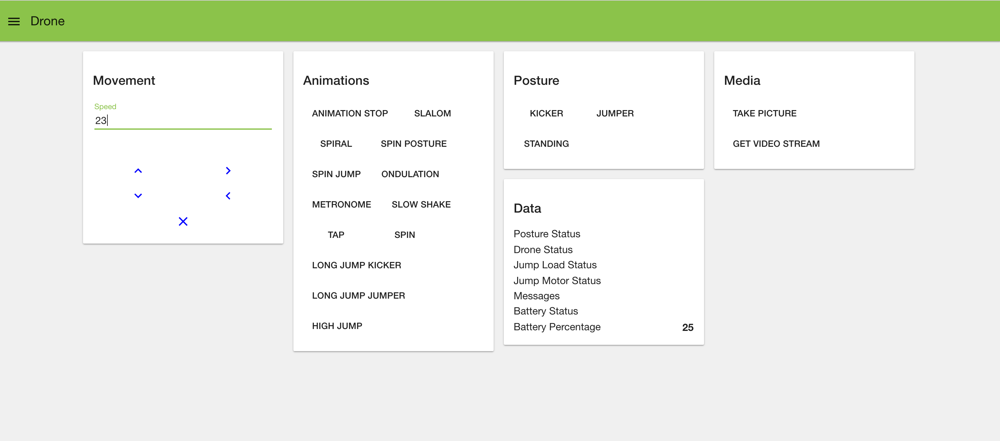

### Overview

This project aims to provide a Nodes in Node-Red that can be used to control and monitor the data of Parrot drones based on Parrot <a href="http://developer.parrot.com/docs/SDK3">ARDroneSDK3</a>.

Two nodes is provided as explained below:

* **drone-data**: is an output node that can be used to read all the data received from the drone such as battery, status, etc ..

* **drone-control**: used to execute drone supported commands.

Additionally a configuration node **drone-config** is provided to group all the drone related settings and is accessible by the other nodes.
All the commands and events are tested with real drone to verify that it works as expected.

### Supported Parrot Drones as of now

1. Parrot Jumping Mini Drones <a href="https://github.com/alronz/node-sumo">using existing node library</a>.
  
### Install
  
  ```npm i node-red-contrib-parrot-drones```


### Commands

The commands sent to the "drone-control" node is expected to be inside **msg.command** and the command parameters should be inside **msg.payload**. 
Below are the supported commands categorized by drone type:

1. Jumping Mini Drones

* ```forward``` 
Move the drone forward at the specified speed (between 0 and 100). Required input **msg.payload.speed**
* ```backward``` 
Move the drone backward at the specified speed (between 0 and 100). Required input **msg.payload.speed**  
* ```right```
Turn the drone right at the specified speed (between 0 and 100).  Required input **msg.payload.speed**  
* ```left``` 
Turn the drone left at the specified speed (between 0 and 100).  Required input **msg.payload.speed**  
* ```stop``` 
Tell the drone to stop moving.  
* ```posture-kicker```
Move the drone into the kicker posture. The drone jump mechanism is used to kick objects behind the drone. 
* ```posture-jumper```
Move the drone into the jumper posture. The drone jump mechanism is used to propel the drone into the air.  
* ```posture-standing```
Move the drone into the standing (on head) posture.  
* ```animation-slalom```
Make the drone drive in a slalom pattern.  
* ```animation-spiral```
Make the drone drive in a spiral. 
* ```animation-spin-to-posture```
Spin and then change posture.  
* ```animation-spin-jump```
Spin and then jump the drone.  
* ```animation-ondulation```
Perform the ondulation animation.  
* ```animation-metronome```
Perform the metronome animation.  
* ```animation-slow-shake```
Shake the drone from side-to-side.  
* ```animation-tap``` 
Tap the drone jump mechanism.  
* ```animation-spin```
Perform a spin.  
* ```animation-stop```
Stop the pre-programmed animation.  
* ```animation-long-jump-kicker```
Perform a long jump. The drone is in kicker posture before performing this animation.  
* ```animation-long-jump-jumper```
Perform a long jump. The drone is in jumper posture before performing this animation.   
* ```animation-high-jump```
Perform a high jump. The drone needs to be in the jumper posture to use this API.  
* ```take-picture```
Take picture and store it internally  
* ```get-video-stream```
Emits the MJPEG video stream. This will send the data representing the video as a stream of buffer data in **object.payload.video**


### Drone Data and Events

This node will listen to multiple events triggered by the drone and publish the data to **msg.payload** object. 
Below are the publish events categorized by drone type: 

1. Jumping Mini Drones
     
**batteryPercentage** 

A numeric value indicating the current battery level 

**batteryStatus** 

This can be two values based on the events received from the drone as explained below:

* ```critical```
Emitted when the battery is at a critically low level. 
* ```low``` 
Emitted when the battery is at a low level. 


**status** 
 
The status of the drone which can be ```ready```  

**posture** 

The current posture of the drone, this can be 5 values based on the events received from the drone as explained below:
     
* ```standing``` 
Emitted when the drone changes to the standing posture. The event may be emitted slightly before the movement is complete so you may want to wait a short time before sending the drone further commands. 
* ```jumper```
Emitted when the drone changes to the jumper posture. The event may be emitted slightly before the movement is complete so you may want to wait a short time before sending the drone further commands. 
* ```kicker```
Emitted when the drone changes to the kicker posture. The event may be emitted slightly before the movement is complete so you may want to wait a short time before sending the drone further commands. 
* ```stuck```
Emitted when the drone is stuck. 
* ```unknown```
Emitted when the drone posture is unknown. 
     
**jumpLoad** 

The jump loading status of the drone, this can be 6 values based on the events received from the drone as explained below:

* ```busy``` 
Emitted when the jump mechanism is busy (for example, if you tell the drone to jump while a jump is already in progress). 
* ```unloaded``` 
Emitted when the jump mechanism is unloaded (for example, after a jump or kick). The event may be emitted slightly before the movement is complete so you may want to wait a short time before sending the drone further commands. 
* ```loaded``` 
Emitted when the jump mechanism is retracted (for example, after a long jump while in the kicker posture). The event may be emitted slightly before the movement is complete so you may want to wait a short time before sending the drone further commands. 
* ```unknown``` 
Emitted when the load state of the jump mechanism is unknown. 
* ```unloaded and no jump due to battery Low``` 
Emitted when the jump mechanism is unloaded and the drone cannot perform the jump requested because the battery is low. 
* ```loaded and no jump due to battery Low``` 
Emitted when the jump mechanism is unloaded and the drone cannot perform the jump requested because the battery is low. 
     

**jumpMotor** 

The status of the jump motor of the drone, this can be three values based on the events received from the drone as explained below:

* ```ok```
Emitted when the jump motor is OK (it may have previously been blocked or overheated). 
* ```blocked```
Emitted when the jump motor is blocked. 
* ```overheated```
Emitted when the jump motor has overheated. 

**message** 

A message sent from the drone, this can be two values based on the events received from the drone as explained below:

* ```image taken and stored internally```
Emitted when a photo is taken and stored internally (response to takePicture(opts)). 
* ```video frame is (the video frame)```
Emits single MJPEG video frame. 


### Example flow and how it works

The example flow below will show how to control a parrot drone using the "drone-control" node:

    [{"id":"2225687d.0c5988","type":"drone-control","z":"128fc2a1.2fc64d","name":"Drone Control","settings":"c1e2cbff.a51ca8","x":619.5,"y":255,"wires":[["34fe3d0d.3a46a2"]]},{"id":"7747f1b8.aadc6","type":"function","z":"128fc2a1.2fc64d","name":"","func":"msg.command = msg.payload;\nmsg.payload = {};\n\nvar speed = flow.get('speed') || 0;\n\nmsg.payload.speed = speed;\nreturn msg;","outputs":1,"noerr":0,"x":413.5,"y":258,"wires":[["2225687d.0c5988"]]},{"id":"34fe3d0d.3a46a2","type":"debug","z":"128fc2a1.2fc64d","name":"","active":true,"console":"false","complete":"true","x":878.5,"y":260,"wires":[]},{"id":"34469adb.cdf3a6","type":"ui_text_input","z":"128fc2a1.2fc64d","tab":"aec1e0f8.c48b4","mode":"text","delay":300,"name":"Speed","topic":"speed","group":"Movement","order":1,"x":76.5,"y":146,"wires":[["98cd5977.c430c8"]]},{"id":"98cd5977.c430c8","type":"function","z":"128fc2a1.2fc64d","name":"","func":"\nflow.set('speed',msg.payload);\n\nreturn msg;","outputs":"1","noerr":0,"x":219,"y":145,"wires":[[]]},{"id":"ef8de3aa.e35a9","type":"ui_button_row","z":"128fc2a1.2fc64d","tab":"aec1e0f8.c48b4","name":"Up-Right","topic":"","group":"Movement","order":1,"toggle":false,"buttons":[{"payload":"forward","icon":"keyboard_arrow_up","color":"Blue","on_icon":"alarm_on","on_color":"red"},{"payload":"right","icon":"keyboard_arrow_right","color":"Blue","on_icon":"keyboard_arrow_down","on_color":"Blue"}],"inputs":0,"x":81.5,"y":204,"wires":[["7747f1b8.aadc6"]]},{"id":"457c0395.e4103c","type":"ui_button_row","z":"128fc2a1.2fc64d","tab":"aec1e0f8.c48b4","name":"Down-Left","topic":"","group":"Movement","order":1,"toggle":false,"buttons":[{"payload":"backward","icon":"keyboard_arrow_down","color":"Blue","on_icon":"alarm_on","on_color":"red"},{"payload":"left","icon":"keyboard_arrow_left","color":"Blue","on_icon":"keyboard_arrow_down","on_color":"Blue"}],"inputs":0,"x":81,"y":259,"wires":[["7747f1b8.aadc6"]]},{"id":"3c81b436.8cff3c","type":"ui_button_row","z":"128fc2a1.2fc64d","tab":"aec1e0f8.c48b4","name":"Stop","topic":"","group":"Movement","order":1,"toggle":false,"buttons":[{"payload":"stop","icon":"clear","color":"Blue","on_icon":"alarm_on","on_color":"red"}],"inputs":0,"x":71,"y":311,"wires":[["7747f1b8.aadc6"]]},{"id":"c0378e04.5fddd","type":"ui_template","z":"128fc2a1.2fc64d","tab":"aec1e0f8.c48b4","name":"Animations","group":"Animations","order":1,"format":"<md-button ng-click=\"send({payload: 'animation-stop'})\">\n  Animation Stop\n</md-button>\n\n<md-button ng-click=\"send({payload: 'animation-slalom'})\">\n  Slalom\n</md-button>\n\n<md-button ng-click=\"send({payload: 'animation-spiral'})\">\n  Spiral\n</md-button>\n\n<md-button ng-click=\"send({payload: 'animation-spin-to-posture'})\">\n  Spin Posture\n</md-button>\n\n<md-button ng-click=\"send({payload: 'animation-spin-jump'})\">\n  Spin Jump\n</md-button>\n\n<md-button ng-click=\"send({payload: 'animation-ondulation'})\">\n  Ondulation\n</md-button>\n\n<md-button ng-click=\"send({payload: 'animation-metronome'})\">\n  Metronome\n</md-button>\n\n<md-button ng-click=\"send({payload: 'animation-slow-shake'})\">\n  Slow Shake\n</md-button>\n\n<md-button ng-click=\"send({payload: 'animation-tap'})\">\n  Tap\n</md-button>\n\n<md-button ng-click=\"send({payload: 'animation-spin'})\">\n  Spin\n</md-button>\n\n<md-button ng-click=\"send({payload: 'animation-long-jump-kicker'})\">\n  Long Jump Kicker\n</md-button>\n\n<md-button ng-click=\"send({payload: 'animation-long-jump-jumper'})\">\n  Long Jump Jumper\n</md-button>\n\n<md-button ng-click=\"send({payload: 'animation-high-jump'})\">\n  High Jump\n</md-button>","storeOutMessages":true,"fwdInMessages":true,"x":81.5,"y":453,"wires":[["7747f1b8.aadc6"]]},{"id":"e17316ed.020258","type":"ui_template","z":"128fc2a1.2fc64d","tab":"aec1e0f8.c48b4","name":"Postures","group":"Posture","order":1,"format":"<md-button ng-click=\"send({payload: 'posture-kicker'})\">\n Kicker\n</md-button>\n\n<md-button ng-click=\"send({payload: 'posture-jumper'})\">\n  Jumper\n</md-button>\n\n<md-button ng-click=\"send({payload: 'posture-standing'})\">\n  Standing\n</md-button>","storeOutMessages":true,"fwdInMessages":true,"x":68.5,"y":379,"wires":[["7747f1b8.aadc6"]]},{"id":"c4c919df.d8cc08","type":"ui_template","z":"128fc2a1.2fc64d","tab":"aec1e0f8.c48b4","name":"Media","group":"Media","order":1,"format":"<md-button ng-click=\"send({payload: 'take-picture'})\">\n  Take Picture\n</md-button>\n\n<md-button ng-click=\"send({payload: 'get-video-stream'})\">\n  Get Video Stream\n</md-button>\n\n","storeOutMessages":true,"fwdInMessages":true,"x":87,"y":529,"wires":[["7747f1b8.aadc6"]]},{"id":"c1e2cbff.a51ca8","type":"drone-config","z":"","ip":"192.168.2.1","droneType":"Jumping Drone"},{"id":"aec1e0f8.c48b4","type":"ui_tab","z":"","name":"Drone","icon":"dashboard","order":"1"}]

And the below flow will show how to see all the drone data using the "drone-data" node:

    [{"id":"1a312d3.7f9ead3","type":"drone-data","z":"c560f4ff.b48658","name":"Drone Data","settings":"c1e2cbff.a51ca8","x":124,"y":254,"wires":[["40d7160b.ec11b8","df9a2af4.9817d8"]]},{"id":"40d7160b.ec11b8","type":"debug","z":"c560f4ff.b48658","name":"","active":true,"console":"false","complete":"true","x":226.5,"y":405,"wires":[]},{"id":"d48ed1a5.b6436","type":"ui_text","z":"c560f4ff.b48658","tab":"aec1e0f8.c48b4","name":"Posture Status","group":"Data","order":1,"format":"{{msg.payload.posture}}","x":747,"y":238,"wires":[]},{"id":"63758a61.c32d54","type":"ui_text","z":"c560f4ff.b48658","tab":"aec1e0f8.c48b4","name":"Drone Status","group":"Data","order":1,"format":"{{msg.payload.status}}","x":734.5,"y":289,"wires":[]},{"id":"e8dc38cc.64e188","type":"ui_text","z":"c560f4ff.b48658","tab":"aec1e0f8.c48b4","name":"Jump Load Status","group":"Data","order":1,"format":"{{msg.payload.jumpLoad}}","x":759.5,"y":343,"wires":[]},{"id":"9310d160.4c77d","type":"ui_text","z":"c560f4ff.b48658","tab":"aec1e0f8.c48b4","name":"Jump Motor Status","group":"Data","order":1,"format":"{{msg.payload.jumpMotor}}","x":752.5,"y":402,"wires":[]},{"id":"d5ee8c50.8f28b","type":"ui_text","z":"c560f4ff.b48658","tab":"aec1e0f8.c48b4","name":"Messages","group":"Data","order":1,"format":"{{msg.payload.message}}","x":730.5,"y":458,"wires":[]},{"id":"3742a1ee.5b2ebe","type":"ui_text","z":"c560f4ff.b48658","tab":"aec1e0f8.c48b4","name":"Battery Status","group":"Data","order":1,"format":"{{msg.payload.batteryStatus}}","x":740.5,"y":185,"wires":[]},{"id":"df9a2af4.9817d8","type":"switch","z":"c560f4ff.b48658","name":"","property":"topic","propertyType":"msg","rules":[{"t":"eq","v":"batteryPercentage","vt":"str"},{"t":"eq","v":"batteryStatus","vt":"str"},{"t":"eq","v":"posture","vt":"str"},{"t":"eq","v":"status","vt":"str"},{"t":"eq","v":"jumpLoad","vt":"str"},{"t":"eq","v":"jumpMotor","vt":"str"},{"t":"eq","v":"message","vt":"str"}],"checkall":"true","outputs":7,"x":344,"y":255,"wires":[["8209fbee.1afdb8"],["3742a1ee.5b2ebe"],["d48ed1a5.b6436"],["63758a61.c32d54"],["e8dc38cc.64e188"],["9310d160.4c77d"],["d5ee8c50.8f28b","eb5f127c.3ed38","1ba3b1fb.5c0bce"]]},{"id":"eb5f127c.3ed38","type":"switch","z":"c560f4ff.b48658","name":"","property":"payload.buf","propertyType":"msg","rules":[{"t":"nnull"}],"checkall":"true","outputs":1,"x":368,"y":513,"wires":[["7e79f4c2.bfd0ec"]]},{"id":"c8897980.48bd18","type":"debug","z":"c560f4ff.b48658","name":"","active":true,"console":"false","complete":"true","x":719.5,"y":660,"wires":[]},{"id":"7e79f4c2.bfd0ec","type":"function","z":"c560f4ff.b48658","name":"","func":"var originalBuf = msg.payload.buf;\nvar buf = new Buffer(originalBuf);\nmsg.payload = buf;\nmsg.payload.image = true;\nreturn msg;\n","outputs":1,"noerr":0,"x":515,"y":521,"wires":[["da8b21cb.331d2","c8897980.48bd18"]]},{"id":"b7c91a07.d30a18","type":"ui_template","z":"c560f4ff.b48658","tab":"aec1e0f8.c48b4","name":"","group":"Image","order":1,"format":"","storeOutMessages":true,"fwdInMessages":true,"x":1002,"y":616,"wires":[[]]},{"id":"da8b21cb.331d2","type":"switch","z":"c560f4ff.b48658","name":"","property":"payload.image","propertyType":"msg","rules":[{"t":"true"}],"checkall":"true","outputs":1,"x":671,"y":521,"wires":[["86a6069c.3b2b18"]]},{"id":"1ba3b1fb.5c0bce","type":"debug","z":"c560f4ff.b48658","name":"","active":true,"console":"false","complete":"true","x":177.5,"y":579,"wires":[]},{"id":"86a6069c.3b2b18","type":"base64","z":"c560f4ff.b48658","name":"","x":861,"y":542,"wires":[["b7c91a07.d30a18"]]},{"id":"8209fbee.1afdb8","type":"ui_text","z":"c560f4ff.b48658","tab":"aec1e0f8.c48b4","name":"Battery Percentage","group":"Data","order":1,"format":"{{msg.payload.batteryPercentage}}","x":742.5,"y":126,"wires":[]},{"id":"c1e2cbff.a51ca8","type":"drone-config","z":"","ip":"192.168.2.1","droneType":"Jumping Drone"},{"id":"aec1e0f8.c48b4","type":"ui_tab","z":"","name":"Drone","icon":"dashboard","order":"1"}]


The flows will generate a UI that can be accessed using http://127.0.0.1:1880/ui which shown in the screen shot below:

